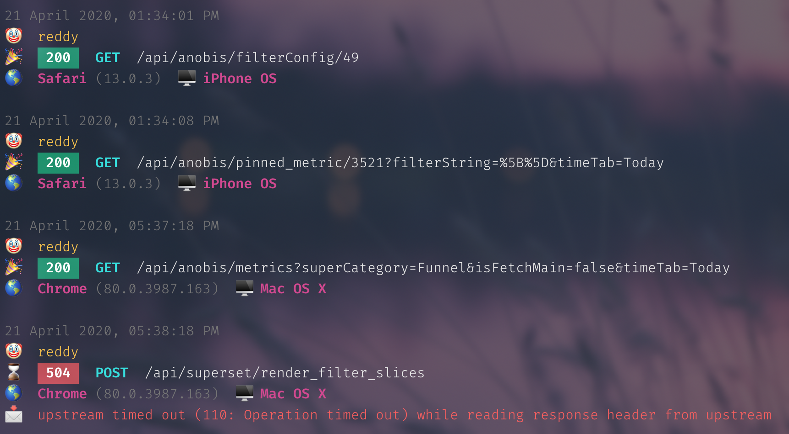

## NGINX Pretty Log Viewer



### Build

```
go build  -o $GOPATH/bin/nginx-log-viewer main.go
```

### Usage

```console
docker logs -f | nginx-log-viewer
```

### Sample Test

```console
cat sample | go run main.go
```
